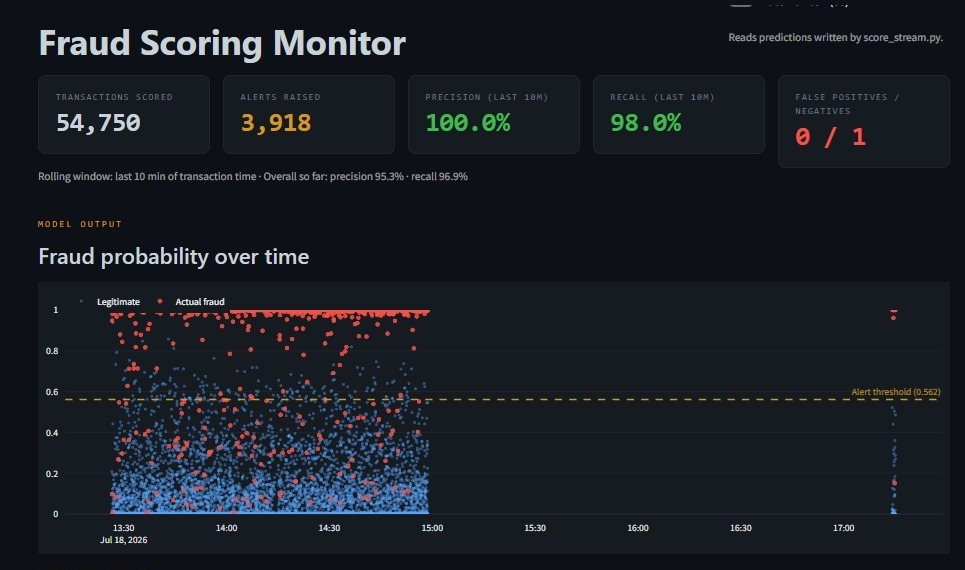
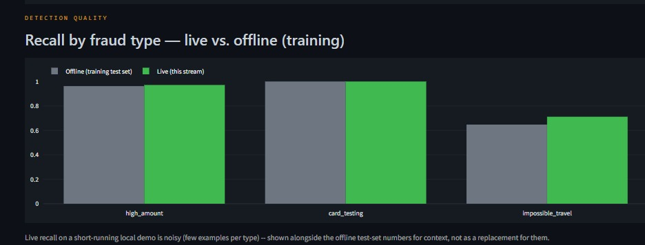
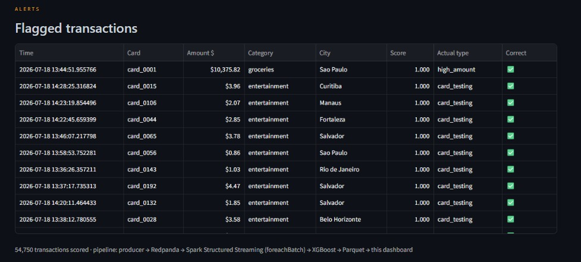

# Real-Time Fraud Detection — ML Scoring Layer

An applied machine-learning layer on top of [`realtime-fraud-streaming`](https://github.com/DiegoTDDD/realtime-fraud-streaming) (Project 1): an offline-trained **XGBoost** classifier scores the same live transaction stream in real time via **Spark Structured Streaming**, handling severe class imbalance and surfacing model-quality metrics (not just transaction counts) on a live dashboard.

- **Live dashboard:** _(fill in after deploying — see "Deploying the dashboard" below)_
- **Repo:** github.com/DiegoTDDD/realtime-fraud-detection-ml
- **Depends on:** github.com/DiegoTDDD/realtime-fraud-streaming (producer + Redpanda broker)
- **Case study:** see `docs/case_study.pdf`

---

## Skills demonstrated

- **Applied ML on imbalanced data** — class weights (not resampling) for a ~2-7% fraud rate, PR-AUC as the primary metric, a documented threshold-selection strategy (macro-recall across fraud types under a precision floor, not a default 0.5 or aggregate F1)
- **Feature engineering with a falsifiable process** — three iterations tested and measured against the held-out test set for the hardest fraud pattern, with the two rejected approaches documented alongside the reasoning for why they didn't work
- **Streaming ML serving** — a trained model integrated into Spark Structured Streaming via `foreachBatch`, with feature parity enforced between training and serving to avoid training-serving skew
- **Stateful streaming under a documented constraint** — velocity features computed across micro-batches using process-local state, with the single-process limitation stated explicitly rather than glossed over
- **Real-world Windows/Spark debugging** — resolved five distinct infrastructure failures end-to-end (missing Hadoop native binaries, a non-persistent Kafka topic, Python worker spawn failures, schema-inference errors on null columns), each with a root-cause explanation, not just a fix
- **ML-aware dashboarding** — live precision/recall (not just volume), because Project 1's injected ground-truth labels make this rare "self-grading" view possible

---

## Why this project

Project 1 built the streaming backbone — event flow, windowed aggregation, a descriptive dashboard — and closed with an explicit roadmap: turn the descriptive monitor into a predictive one. This project does that: the same stream, scored transaction-by-transaction by a model trained offline on the injected fraud patterns, with the model's real-world performance (not just its offline test-set numbers) visible on a live dashboard.

---

## Architecture

```
┌────────────┐     ┌────────────┐     ┌──────────────────────┐     ┌──────────────┐     ┌─────────────┐
│  Producer  │     │  Redpanda  │     │  Spark Structured     │     │   Parquet    │     │  Streamlit  │
│ (Project 1)│ ──▶ │ (Kafka API)│ ──▶ │  Streaming            │ ──▶ │  Predictions │ ──▶ │  Dashboard  │
│            │     │            │     │                       │     │              │     │             │
│ card txns  │     │  topic:    │     │ foreachBatch:         │     │  tx + score +│     │ live P/R +  │
│ + labels   │     │transactions│     │ feature eng. + XGBoost│     │  prediction  │     │ alert feed  │
└────────────┘     └────────────┘     └──────────────────────┘     └──────────────┘     └─────────────┘
                                                  ▲
                                                  │ loads once, not per batch
                                          ┌───────┴────────┐
                                          │ training/       │
                                          │ model.joblib     │
                                          │ (offline-trained)│
                                          └──────────────────┘
```

This job is an **independent second consumer** of Project 1's `transactions` topic — it doesn't modify or depend on Project 1's own Bronze/Gold pipeline running at the same time, only on the topic existing.

---

## The model

**Training data:** Project 1's Bronze layer (real transaction history) had only 189 fraud examples — too few for stable metrics. Rather than modify the producer's logic, its exact transaction-generation logic (same card population, same three fraud patterns, same base rates) was reused in a standalone batch script (`training/generate_training_data.py`) to generate 150,000 transactions directly to Parquet, without running Kafka/Spark for hours.

**Class imbalance:** class weights (`scale_pos_weight` in XGBoost), not resampling — preserves the real data distribution. Evaluated with PR-AUC, since accuracy is meaningless at this class balance.

**Threshold selection:** not the default 0.5, and not the aggregate-F1-optimal point either — both get dominated by whichever fraud pattern has the most examples (`card_testing`, at ~83% of fraud volume here). The final threshold maximizes the *average* recall across the three fraud types, under a 95% precision floor (an alert budget a real fraud team could act on).

**Final offline metrics** (held-out, chronological 20% test split):

| Metric | Value |
|---|---|
| PR-AUC | 0.9925 |
| Precision @ threshold | 95.75% |
| Recall @ threshold | 96.55% |
| Recall — high_amount | 96.2% |
| Recall — card_testing | 100% |
| Recall — impossible_travel | 64.7% |

### Feature engineering: three iterations on `impossible_travel`

`high_amount` and `card_testing` were straightforward to separate. `impossible_travel` was not, and the process of getting there — including two rejected approaches — is documented because it's more informative than the final number alone:

| Approach | Recall (`impossible_travel`) | Why it stalled |
|---|---|---|
| Binary `is_unusual_city` flag | 0.59–0.65 | Too coarse — can't distinguish a nearby trip from a cross-country jump |
| `implied_speed_kmh` (distance from the *previous* transaction / elapsed time) | 0.62 | This dataset's per-card transaction cadence means the "previous transaction" is often hours away, so elapsed-time-aware speed doesn't reliably flag a geographically anomalous but time-isolated transaction |
| `distance_km_from_home` (Haversine, from an inferred home city) — **final** | **0.65** | Best of the three tested; kept |

**Known limitation:** 0.65 recall on `impossible_travel` is a real gap, not a rounding error. Root cause: only ~190 test examples of this pattern (high sampling variance), and 15% of Project 1's *legitimate* transactions also occur away from the card's home city, so distance alone has an irreducible false-negative rate without more data or a stronger signal (e.g. an actual flight-time feasibility model). This is stated here rather than hidden because a recruiter who runs the numbers will find it either way.

---

## Tech stack

- **Model:** XGBoost, scikit-learn (training + evaluation)
- **Serving:** Spark Structured Streaming (PySpark 3.5), `foreachBatch`
- **Streaming broker:** Redpanda (Kafka API) — from Project 1, reused as-is
- **Storage:** Parquet (predictions)
- **Dashboard:** Streamlit + Plotly
- **Runtime:** Python 3.11 (conda envs `fraud-ml` for this repo, `fraud` for Project 1's producer), Windows + Git Bash

---

## Dashboard

### Live precision/recall + probability distribution


### Recall by fraud type — live vs. offline


### Flagged transactions feed


---

## Running it locally

This pipeline spans two repos and the pieces must be started in the order below. The scoring job's Kafka source resolves partition offsets on startup, which fails outright (`UnknownTopicOrPartitionException`) if the `transactions` topic doesn't exist yet — and the topic isn't created until the producer publishes its first message. Starting the producer before the scoring job isn't a style preference; the reverse order was tested and fails.

### Prerequisites

- Docker Desktop installed and running
- Java 17 installed (`java -version` should report 17)
- **Windows only:** `C:\hadoop\bin\winutils.exe` and `C:\hadoop\bin\hadoop.dll` present. Get them from the community `cdarlint/winutils` repo — use the **raw.githubusercontent.com** URL, not a `github.com/.../raw/...` link (the latter can silently return an HTML page instead of the binary). A patch-version mismatch with the Hadoop version Spark resolves at runtime (e.g. binaries from `hadoop-3.3.5` against a Spark build pulling `hadoop-client-runtime:3.3.4`) is fine.
- A local clone of [`realtime-fraud-streaming`](https://github.com/DiegoTDDD/realtime-fraud-streaming) (Project 1) as a sibling directory — this repo reuses its Redpanda broker and producer, not a copy of them.

### Steps

**1. Set up this repo's environment**
```bash
conda create -n fraud-ml python=3.11 -y
conda activate fraud-ml
pip install -r requirements.txt
```

**2. Set up Project 1's environment** (separate env, its own `requirements.txt` — it needs `confluent-kafka` and `faker`, which this repo's model/serving code doesn't)
```bash
cd ../realtime-fraud-streaming
conda create -n fraud python=3.11 -y
conda activate fraud
pip install -r requirements.txt
```

**3. Start Redpanda** (still in the Project 1 repo)
```bash
docker compose up -d redpanda
```

**4. Train the model** — **this repo** (not the Project 1 repo), `fraud-ml` env. One-time, or whenever retraining; doesn't need Redpanda running:
```bash
cd ../realtime-fraud-detection-ml
conda activate fraud-ml
python training/generate_training_data.py
python training/train_model.py
```

**5. Start the producer** — **terminal 1**, Project 1 repo, `fraud` env. This is the step that creates the `transactions` topic if it doesn't already exist (e.g. after a container restart with no persistent volume):
```bash
cd ../realtime-fraud-streaming
conda activate fraud
python producer/producer.py
```
Leave it running. Wait for the first `sent=... frauds=...` line before moving on — that confirms the topic exists.

**6. Start the scoring job** — **terminal 2**, this repo, `fraud-ml` env:
```bash
cd realtime-fraud-detection-ml
conda activate fraud-ml
python scoring/score_stream.py
```
`startingOffsets: earliest` means it reprocesses the full topic history on first run, so expect one large initial batch before it settles into small continuous ones.

**7. Launch the dashboard** — **terminal 3**, this repo, `fraud-ml` env:
```bash
conda activate fraud-ml
streamlit run dashboard/app.py
```

Open `http://localhost:8501`.

### Checking the topic exists

`docker exec redpanda rpk topic list` shows what topics currently exist on the broker. If `transactions` isn't there — common after a host reboot, since Project 1's Redpanda container doesn't use a persistent volume by default — step 6 will fail. Go back to step 5 and confirm the producer has logged at least one `sent=... frauds=...` line before retrying.

---

## Deploying the dashboard

Streamlit Community Cloud runs plain Python only — no Docker, no Spark, no local Redpanda broker — so the deployed dashboard can't run the live scoring pipeline itself. It reads a small, versioned sample instead, the same pattern Project 1 uses for its own deployed dashboard.

**One-time, before deploying:**

1. Run the full local pipeline for a while (producer + scoring job) so `data/predictions/` has a reasonable amount of data.
2. Export a sample:
   ```bash
   python scoring/export_sample.py
   ```
   This writes `data/predictions_sample/predictions_sample.parquet` — capped at 8,000 rows, keeping every flagged transaction plus a random sample of the rest, so the alerts feed and precision/recall charts stay meaningful. Unlike `data/predictions/`, this sample file is **not** gitignored — it's meant to be committed.
3. Commit and push it:
   ```bash
   git add data/predictions_sample/predictions_sample.parquet
   git commit -m "Add dashboard sample for deployment"
   git push
   ```

**Deploying:**

1. On [share.streamlit.io](https://share.streamlit.io), create a new app from this repo, branch `master`, main file path `dashboard/app.py`.
2. Set the app's dependency file to `dashboard/requirements.txt` (not the root `requirements.txt` — that one includes `pyspark` and `xgboost`, which the dashboard itself never imports and which would slow the build for no reason).
3. Deploy. `dashboard/app.py` detects that `data/predictions/` is empty in the cloud environment and automatically falls back to the committed sample — no code changes needed between local and deployed runs.

The deployed dashboard will show a caption noting it's reading the versioned sample rather than a live pipeline, exactly as Project 1's does.

---

## Project layout

```
realtime-fraud-detection-ml/
├── training/
│   ├── generate_training_data.py   # batch data generation (reuses Project 1's fraud logic)
│   ├── train_model.py              # feature engineering + XGBoost + threshold selection
│   ├── model.joblib                # trained model + feature list + threshold (gitignored)
│   ├── card_home_city.json         # home-city mapping, reused identically at serving time
│   └── metrics.json                # offline evaluation results
├── scoring/
│   ├── score_stream.py             # Spark Structured Streaming + foreachBatch scoring job
│   └── export_sample.py            # exports a small versioned sample for the deployed dashboard
├── dashboard/
│   ├── app.py                      # Streamlit live model-quality dashboard
│   └── requirements.txt            # lightweight deps for the deployed dashboard (no Spark/XGBoost)
├── data/
│   ├── training_raw.parquet        # batch-generated training set (gitignored)
│   ├── predictions/                # scored live transactions (gitignored)
│   ├── predictions_sample/         # small sample for the deployed dashboard (committed)
│   └── _checkpoints/               # Spark streaming checkpoints (gitignored)
├── docs/
│   ├── screenshots/
│   └── case_study.pdf
├── requirements.txt
└── .gitignore
```

---

## Notes on the data

Training data is synthetic, generated by reusing Project 1's exact transaction-simulation logic in batch rather than by running the real-time producer for hours. Live scoring runs against Project 1's actual Kafka stream. Ground-truth fraud labels (injected by the producer) make it possible to show live precision/recall on the dashboard — most real-world fraud dashboards can't do this, since they don't have an oracle to check predictions against in real time.

The deployed dashboard reads a small consolidated sample of scored predictions (see "Deploying the dashboard" above), because the cloud host runs neither Spark nor Docker; the full local pipeline regenerates unlimited live data on demand.
